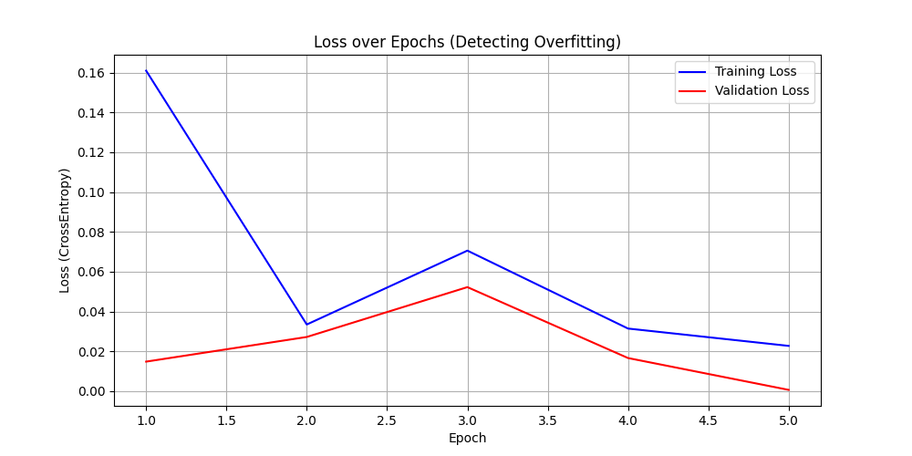

# 🔬 Lung Histology Cancer Detection - Web Application

This project implements a three-tier web application designed for the classification of lung histology image patches (histopathological images) into Malignant (Cancerous: Adenocarcinoma/Squamous Cell Carcinoma) or Benign (Non-Cancerous).

The application uses a PyTorch deep learning model served by a FastAPI backend and accessed via an Angular frontend.

## 🚀 Key Technologies

* Frontend: Angular (Standalone Components, TypeScript, HttpClient)

* Backend/API: FastAPI (Python)

* Machine Learning: PyTorch (Transfer Learning with EfficientNet-B0)

* Data Handling: Uploads handled via FastAPI, model weights loaded via model.py.

## 📊 Model Performance and Training

The model was trained using Transfer Learning on the LC25000 Lung Histology Image Dataset, utilizing an EfficientNet-B0 architecture.

The plot below shows the training performance, where the model successfully converged to near-zero loss on the validation set, indicating robust generalization.

## 🛠️ Setup and Running the Project

To run this project, you need two separate terminals—one for the backend (Python) and one for the frontend (Angular).

**NOTE: All Python commands must be executed within the activated venv_311 environment.**

### Prerequisites

* Node.js/NPM: Must be installed in your WSL/Ubuntu environment.
* Python 3.11+: Must be installed (ideally in a virtual environment).
* Data: The histology_classifier_final.pth model weights file must be present in the backend/ directory.

Step 1: Start the Backend (FastAPI)

The backend must be started first to ensure the frontend can connect to the running PyTorch model.

* Open your WSL/Ubuntu terminal.

* Navigate to the project root (LUNG-CANCER-DETECTION-CODEJAM/).

* Activate the Python environment: **source venv_311/Scripts/activate**

* Start the FastAPI server: **python -m uvicorn backend.main:app --reload**
--> Wait for the console to display: INFO: Application startup complete.

Step 2: Start the Frontend (Angular)

* You will need a second terminal (still running WSL/Ubuntu) for the Angular development server.

* Open a new WSL/Ubuntu terminal.

* Navigate to the Angular project directory (e.g., cd frontend/ui).

* Run the serve command: **ng serve**
--> Wait for the console to display: Compiled successfully. Angular Live Development Server is listening on localhost:4200

Step 3: Access the Application

Open your web browser and navigate to:

$$\text{http://localhost:4200}$$

You can now upload a histology image patch (JPEG or PNG) and see the prediction returned by the PyTorch model running in the FastAPI backend!